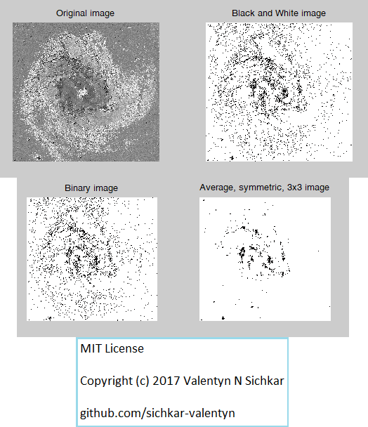
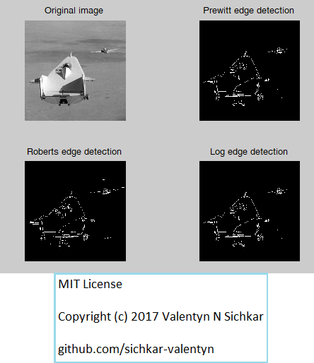
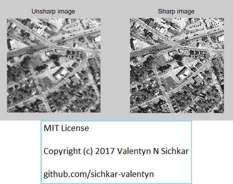
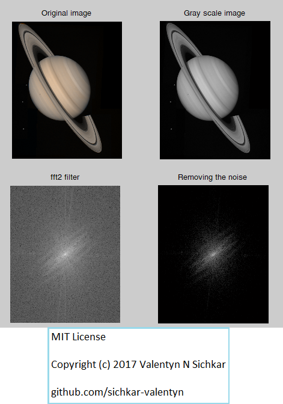

# Matlab and FIR Filters
Two-Dimensional Finite Impulse Response (FIR) filters in Matlab

### Reference to:
[1] Valentyn N Sichkar. Two-Dimensional Finite Impulse Response (FIR) Filters in Matlab // GitHub platform [Electronic resource]. URL: https://github.com/sichkar-valentyn/Matlab_and_FIR_Filters (date of access: XX.XX.XXXX)

## Description
Learning Matlab's functions to show the differences between original images and images after filtering with FIR filters

## Low pass filter

## High pass filter

## Sharpness increasing

## Fourier transformation

## MIT License
## Copyright (c) 2017 Valentyn N Sichkar
## github.com/sichkar-valentyn
### Reference to:
[1] Valentyn N Sichkar. Two-Dimensional Finite Impulse Response (FIR) Filters in Matlab // GitHub platform [Electronic resource]. URL: https://github.com/sichkar-valentyn/Matlab_and_FIR_Filters (date of access: XX.XX.XXXX)
